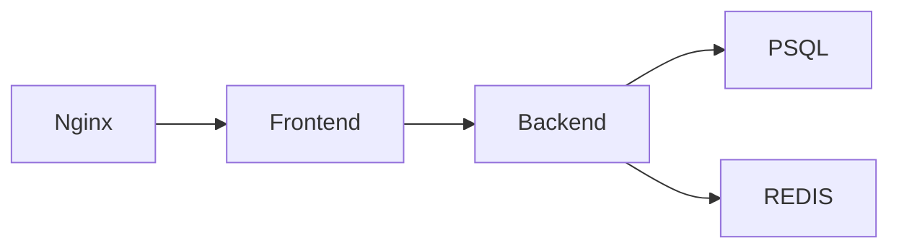

# Applications

- Applications written in **Python** for this project
- They are sharing the almost same code base, there is only few differences for separating frontend/backend

## Frontend
Frontend mostly acts like reverse-proxy, it receives requests from NGINX and forwarding them to Backend.
I created this flow to show traces and explain the communications between pods better.

## Backend
Backend is handling the data process for the project. It receives the request from frontend and send queries to PSQL and cache the responses with **Redis**.
